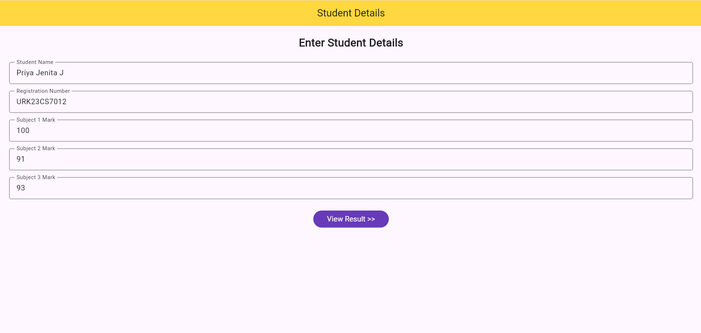
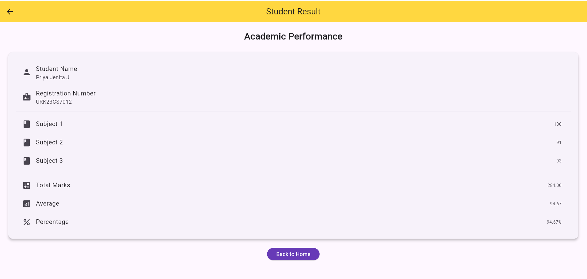
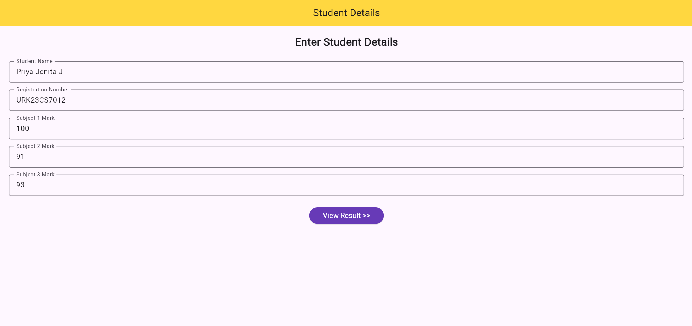

# Experiment 5 – Implementation of Navigation and Routing

## Aim

To understand and implement navigation and routing mechanisms in a Flutter application, enabling users to move between multiple screens and pass data between them using named routes.

## Description

This experiment demonstrates the implementation of Navigation and Routing in Flutter using a Student Performance application.

The application consists of two screens:

- **Student Details Screen** – Allows the user to enter the student's name, registration number, and marks for three subjects.
- **Student Result Screen** – Receives the student details and displays the calculated total marks, average marks, and percentage.

The application uses:

- **MaterialApp** to define the application and named routes
- **Named Routes** to identify and navigate between screens
- **Navigator.pushNamed()** to move from the Student Details screen to the Student Result screen
- **Navigator.pop()** to return to the previous screen
- **Route Arguments** to pass student data between screens
- **ModalRoute.of(context)** to retrieve the passed data
- **StatefulWidget** to manage the student input form
- **TextEditingController** to read the entered student details
- **Form Validation** to validate the input values
- **StatelessWidget** to display the student result
- **Data Model** to store the student information and calculate the result

The application calculates the student's:

- **Total Marks**
- **Average Marks**
- **Percentage**

## Technologies Used

- Flutter
- Dart
- MaterialApp
- Named Routes
- Navigator.pushNamed()
- Navigator.pop()
- Route Arguments
- ModalRoute
- StatefulWidget
- StatelessWidget
- Form Validation
- TextEditingController

## Output Screenshots

### Student Details Screen

### Student Result Screen

### Navigation Back to Student Details

## Result

A Student Performance application was successfully designed and implemented using Flutter and Dart. The application uses named routes and Navigator methods to navigate between screens, passes student data using route arguments, and successfully calculates and displays the total marks, average marks, and percentage.
